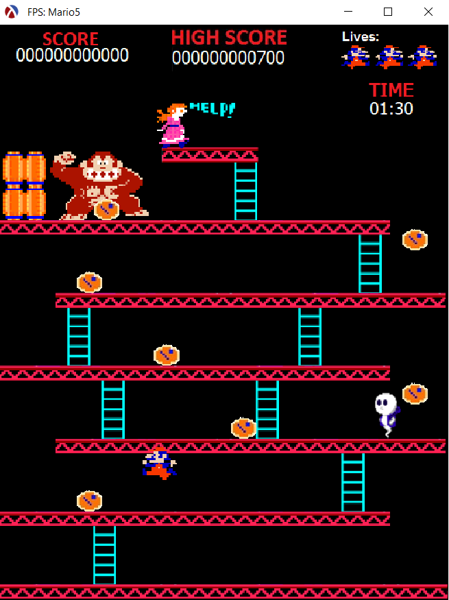
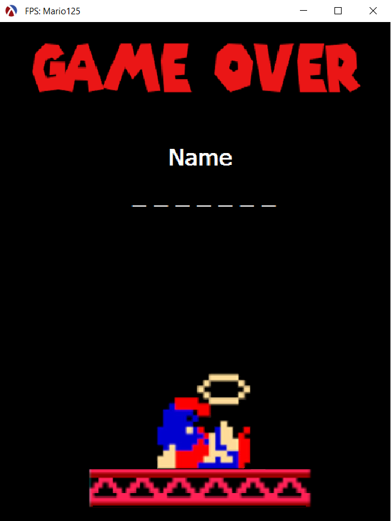

<h1> Programming project 1 (2017-2018) </h1>

### About

This project was made for the course _Programmeerproject 1_ (Programming project 1) at the [Vrije Universiteit Brussel](https://www.vub.be/en), during my first academic year (2017-2018). For this course, we had to remake the famous game [Donkey Kong](https://en.wikipedia.org/wiki/Donkey_Kong_%28arcade_game%29) in which Mario has to rescue Pauline from Donkey Kong.

Besides the classical technical requirements like performance, seperation of concerns and allowed programming language, the other requirements where the following:

- The feeling of the original _Donkey Kong_ game had to be retained.
- A second level entirely designed by us had to be present.
- Something extra chosen by us.

**&rarr; Final mark: 16/20**

### Starting the game

The game can be started by running the _spel.rkt_ file through [_DrRacket_](https://download.racket-lang.org/)

### A glimpse...

